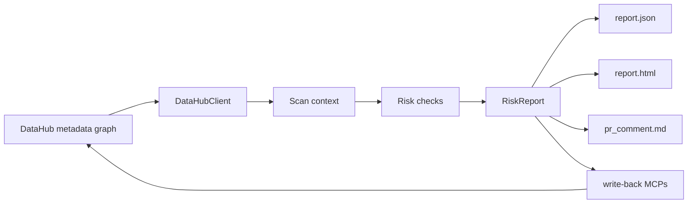

# Architecture

Model Lineage Guard has four layers:

1. DataHub access: `app/datahub_client.py` gathers lineage and metadata.
2. Risk checks: `app/checks/` turns metadata into structured findings.
3. Reporting: `app/report.py` renders JSON, HTML, and Markdown artifacts.
4. Write-back: `app/writeback.py` builds DataHub MCPs for safe audit tags.

